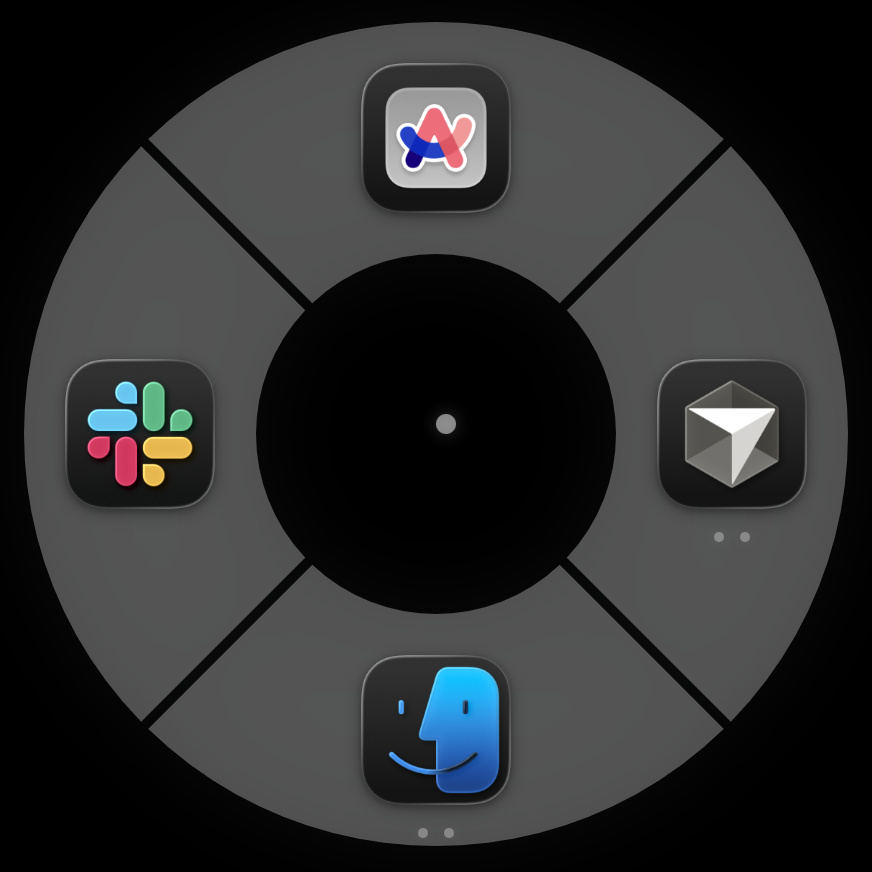
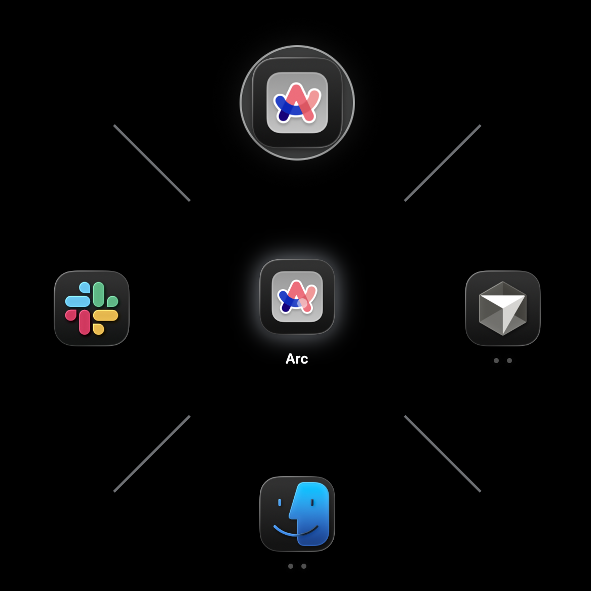
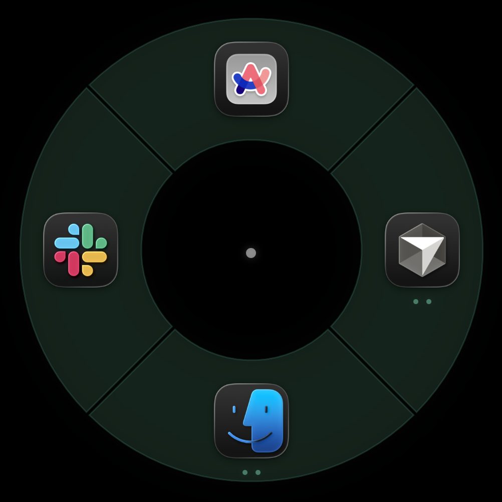
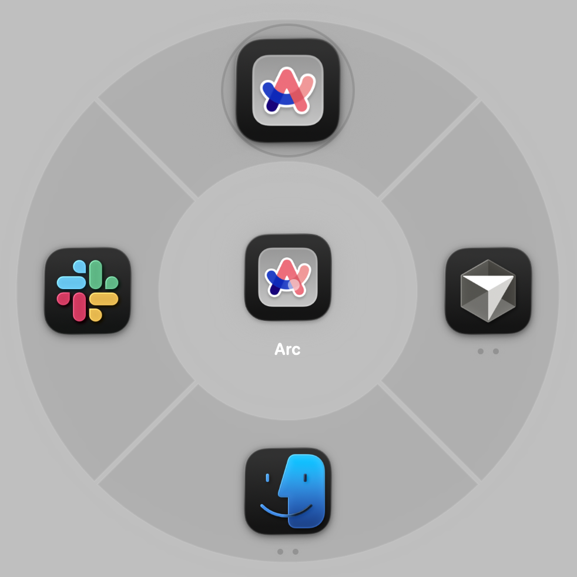

# JazzHands

A radial app switcher for macOS, inspired by the emote wheel in Overwatch. Hold a key combo to summon a ring of your active apps, flick toward the one you want, and release to switch. No clicking, no dock hunting — just muscle memory.


### Themes

Fully customizable — ships with several built-in presets:

<p>
 
</p>
<p>
 
</p>

## How to Run (ELI5)

You need a Mac running macOS 13 or later with the Xcode command-line tools installed.

```bash
# 1. Clone the repo
git clone <repo-url> && cd jazzhands

# 2. Build and install (puts JazzHands.app in ~/Applications)
bash build.sh

# That's it. JazzHands is now running in your menu bar (look for the icon).
```

On first launch you'll be asked to grant two permissions:

1. **Accessibility** — lets JazzHands listen for your hotkey and raise windows. Go to **System Settings → Privacy & Security → Accessibility** and toggle JazzHands on.
2. **Screen Recording** — lets JazzHands capture window thumbnails for Deep Orbit. Same path but under **Screen Recording**.

After granting both, restart JazzHands from the menu bar icon (Quit → relaunch, or just run `bash build.sh` again).

## Usage

### Primary Ring

| Action | What happens |
|--------|-------------|
| **Hold Option + Space** | Summons the radial ring of active apps |
| **Move mouse** | Highlights the app in that direction |
| **Release Option** | Switches to the highlighted app |
| **Quick tap** (< 200ms) | Toggles to the last-used app |
| **Tab** (while held) | Cycles selection clockwise |
| **Backtick** (while held) | Cycles selection counter-clockwise |

### Deep Orbit (Window Picker)

When you hover over a multi-window app for 500ms (configurable), a second ring fans out showing individual windows with thumbnails. Move outward to pick a specific window, or move to a different app to switch targets. Release to activate.

### Settings

Right-click (or click) the menu bar icon → **Settings** to configure:

- **Shortcut** — change the trigger key combo (default: Option + Space)
- **Appearance** — ring colors, glow, opacity, icon size, segment borders
- **Behavior** — hover delay, cursor sensitivity, dead zone, deep orbit toggle
- **Animation** — parent wedge slide on deep orbit entry
- **Presets** — save and load full appearance configurations

## Requirements

- macOS 13.0+
- Swift 5.9+ (Xcode 15+ or standalone toolchain)
